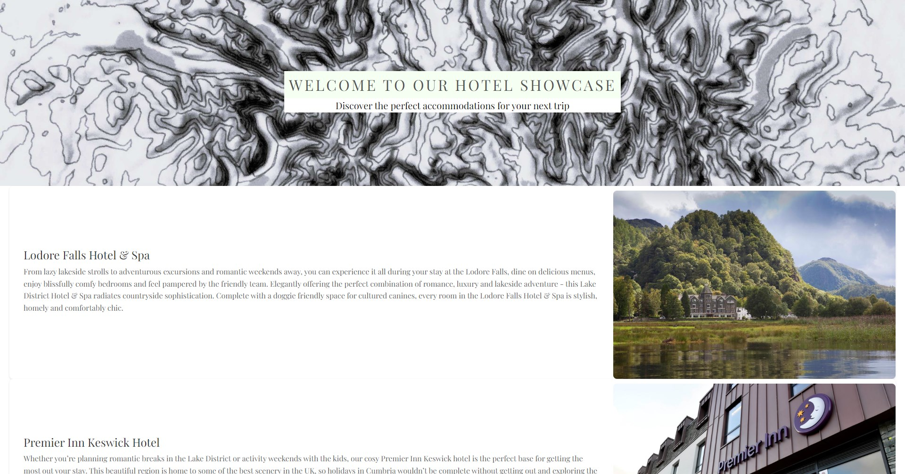
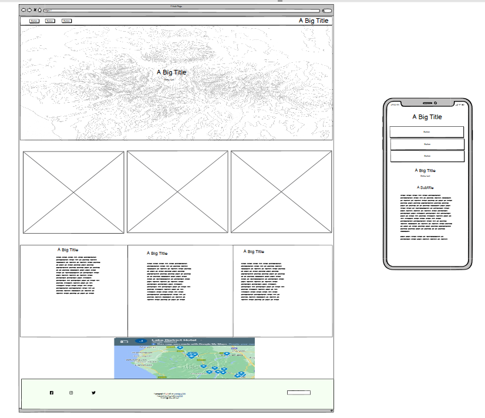
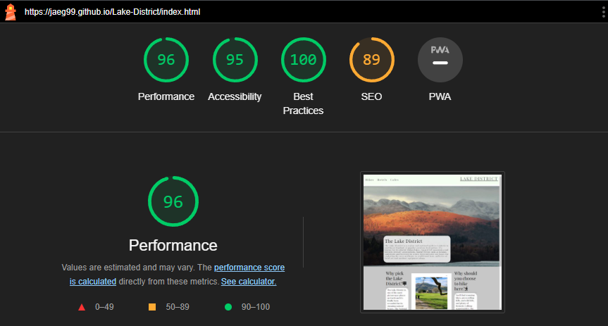

<h1 align="center">The Lake District Tourist Website</h1>

[View the live project here](https://jaeg99.github.io/Lake-District/index.html)

The Lake District is a website that allows newer travellers to the area to be able to get a good understanding of the places to visit and enjoy. the main function of the website it to be a short and concise way for travellers and hikers to be able to find the quick info they want, whether that is walks, hotels or cafes to fill up in. The site will be useful as it will give people the ability to get good starting info if they want to visit the area.

## Index – Table of Contents

- [Index – Table of Contents](#index--table-of-contents)
- [User Experience (UX)](#user-experience-ux)
- [Features](#features)
  - [Existing Features](#existing-features)
  - [Features which I would like to impliment in the future](#features-which-i-would-like-to-impliment-in-the-future)
  - [Design](#design)
  - [Wireframes](#wireframes)
  - [Technologies Used](#technologies-used)
  - [Browser Compatibility](#browser-compatibility)
  - [Known Bugs](#known-bugs)
- [Deployment](#deployment)
  - [How this site was deployed](#how-this-site-was-deployed)
  - [How to clone the repository](#how-to-clone-the-repository)
- [Credits](#credits)
  - [Code](#code)
  - [Media](#media)
  - [Tools](#tools)
  - [Acknowledgments](#acknowledgments)

## User Experience (UX)

* ### User stories

  * #### A. First Time Visitor Goals

        1. As a First Time Visitor, I want to easily understand the main purpose of the site and learn the information i want to know.
        2. As a First Time Visitor, I want to be able to easily navigate throughout the site to find content.
        3. As a First Time Visitor, I want to be able to easily navigate to and view the different types of walks and ammenaties.
        4. As a First Time Visitor, I want to be able to easily find where different ammentaies and walks are.
        5. As a First Time Visitor, I want to be able to use a way to see other cafe and Hotel options to be able to look for other options.
        6. As a First Time Visitor, I want to be able to see some info on the general location of The Lake District and what I can expect.

  * #### B. Returning Visitor Goals

        1. As a Returning Visitor, I want to be able to access and view the walks and other accommodations quickly.
        2. As a Returning Visitor, I want to be able to check walk details quickly and easily.
        3. As a Returning Visitor, I want to be able to use social media tags to highlight the site online.

  * #### C. Frequent User Goals

        1. As a Frequent User, I want to be able to sign-up easily for discounts, news and more.

## Features

### Existing Features

* __F01 Navigation Bar__

  * The navigation bar has a steady look and placement on all three pages of the site assisting in clean navigation. It consists of a simple brand, the home page, Hotel, Hikes and Cafe page with hyperlinks and is responsive on multiple display sizes. On small monitors, the home, Menu and phone links move beneath the logo. 

      

- __F02 Landing Page image and call to action__

  * The landing page includes a nice hero image with a zoom effect to draw the initial viewer in. The colours are a simple crisp white, of green and black that ar present and the picture features a dark orange to stand out from the page but also shows that this is a website about the outdoors.

    

    
- __F03 Hero Text__ 

  * On the landing page, there is a small amount of extra info text that is there to draw the user in. The text provides a small snippet of info for the user to get an idea of the location that will be shown and described.

    

- __F04 Infromation Section__

  * Under the hero image, there is a section with more information about the location. The section includes a nice image to also draw the user in and be able to provide them with some more reasons to look more into the site. There is also an image to also draw eyes in.

    

- __F05 Footer__

  * The footer is the same on all 4 pages of the site and is a consistent part of the site to create a feeling of ease of use.

  * The footer includes on the left social links for people to follow the site on social media or be able to share their own journeys in The Lake District.

  * In the middle of the footer has some contact info for the site so that users are able to get in touch with the site for any errors, more info and just to get in contact.

  * The last part of the footer is the signup box. This is for users to be able to sign up for more info to be pushed to them. This could also be a way for people to receive new deals and news from the site that people may find very useful.

     

- __F06 Hikes Page__

    * The Hikes page starts with a big header to let you know which page you are on, it then reveals images and info on each of the selected walks available to the user. They go from Easy to Hard and all have little snippets of info with some bold quick facts about the walk for ease of reading. The images are nicely displayed to show off different scenes from each walk. 

    * The user will see the same colour and first section theme throughout the other pages to create a feeling of good flow. The colours are the same here as they are on the index page and the font is kept consistent throughout the page.

    

- __F07 Cafe Page__

  * The Cafe page follows the same structure as the hikes page in which you have the first title then three images followed by text and info. This creates a good flow for the consistency of the page.

  * At the bottom of the page is a google map that has been used with the search for cafes in the area. This is a good way for people to be able to look for other cafes and also get reviews on them. This will allow the user to be able to if they want to look for cafes closer to where they will be at a given time and allow for them to still enjoy the amenities.

    
    

- __F08 Hotel Page__

    * The Map at the bottom is a way for people to be able to look and find other amenities and such things for themselves. It is a way to look at locations and find what suits the user and also a way to look at more info on certain choices. 

- __F09 Hotel Page__

    * The Hotels page is a new design compared to the other two. While keeping the title card to show a consistent theme, since the page only features two hotels I felt that it would look better with a more stacked layout. The hotels suggested are on the opposite end of the price spectrum to be able to give anyone a feeling of affordability or to meet their purpose.

    * The page does follow the same element of a map from the cafe. This is for the same reason as I have only suggested two hotels but will allow people to look for others when they want to. This will also be a way to look at reviews and locations to suit people's needs.

    
    

- __How these features support the User Stories__

    * The User Stories that were present in the first section of this README we categorised into A for a first-time viewer, B for a returning visitor and C for a frequent visitor. To be able to track which story meets which feature, I created a User Matrix to be able to track a visual feature which meets which. 
  
    

### Features which I would like to impliment in the future

- __Trails section__

    * I would like to implement a section to see the multiple trails for each hike and walk. Some add extra challenge to easier walks and some are there to help you reach the harder peaks in easier ways. It could also be used to plan alternate routes that would be used in the case of weather changes for example if one route is more scramble heavy then you would not want that route on a wet day.

- __Restaurants Section__

  - A section like the cafe one but focused on more restaurants for a relaxing night out. This could mean that with this website alone you could get a brief overview of your whole trip from walking, hotels, cafes and then also where to dine out for the evening.

### Design 

- __Imagery__

    * The hero image was chosen as it was not too bright but also a very striking image of the vista that would be there to draw the user in and highlight the beauty of the area. The second image of the index page is a small little calm image showing more beauty of the area. The images present on each of the walks is a good little way to show the vistas one can expect without spoiling the whole view. The Cafe section just uses nice shots that were seen on each of the cafe's websites to advertise the cafes and which have a visual and general appeal to the user. The Hotel images are there to give you just a quick snippet of what each place looks like so you know before you get there. The topography image was used throughout the design as a way to also acknowledge the site's routes in walking, it reflected the topography of maps but also a call back to Wainwright in its black and white nature.

- __Colour Scheme__

    * The colour scheme is a crisp set of simple colours. The palette was chosen for its simple vibrant look and was inspired by the colour palette company's choice for the location.  
  - (<https://thecolourpalettecompany.com/products/lake-district-prints>)

    

- __Typography__

  - Google Fonts was used to gain the font, I chose Playfair Display as I think it fits the classic look of the website. It was stylish and worked for all aspects of the site for me.

### Wireframes

-  ### Main Page
    
    

-  ### Hike Page

    

-  ### Cafe Page

    

-  ### Hotel Page

    

### Technologies Used

- ## Languages

    - HTML5
    - CSS3

- ## Testing

- [HTML Validator](https://validator.w3.org/)

    - results for index
    
    - results for hike
    
    - results for cafe
    
    - results for hotel
    
    
- [CSS Validator](https://validator.w3.org/)
    - results for CSS
    

### Browser Compatibility

 - Testing and Worked on
    - Chrome Version Version 113.0.5672.127 (Official Build) (64-bit)
    - FireFix Version 113.0.2 (64-bit)
    - Edge Version 113.0.1774.50 (Official build) (64-bit)
    - Opera GX 

- ## Lighthouse
   
    
    - Performance - How the page performs whilst loading.
    - Accessibility - Is the site acccessible for all users and how can it be improved.
    - Best Practices - Site conforms to industry best practices.
    - SEO - Search engine optimisation. Is the site optimised for search engine result rankings.

### Known Bugs

 - ## Resolved
   

## Deployment

### How this site was deployed

- In the GitHub repository, navigate to the Settings tab, then choose Pages from the left hand menu 
- From the source section drop-down menu, select the main Branch
- Once the main branch has been selected, the page will be automatically refreshed with a detailed ribbon display to indicate the successful deployment
- Any changes pushed to the master branch will take effect on the live project

  The live link can be found here - [The Lake District](https://jaeg99.github.io/Lake-District/index.html) 

### How to clone the repository

- Go to the <https://github.com/JAEG99/Lake-District> repository on GitHub
- Click the "Code" button to the right of the screen, click HTTPs and copy the link there
- Open a GitBash terminal and navigate to the directory where you want to locate the clone
- On the command line, type "git clone" then paste in the copied url and press the Enter key to begin the clone process

## Credits 

### Code
 - Code on how to add a hover effect. The basic setup of the home page and CSS. How to make the page responsive : (https://codeinstitute.net/)
 - Embedd google maps into a page : (https://www.maps.ie/create-google-map/)
- Add the submit button and its style : (<https://getbootstrap.com/docs/4.0/components/forms/>)
- Responsive Design : (https://www.w3schools.com/html/html_responsive.asp)
- Image Alignment : (<https://www.w3schools.com/howto/howto_css_images_side_by_side.asp>)
- Hover selector : (<https://www.w3schools.com/cssref/sel_hover.php>)

### Media 
- All images where found through google tools of Usage Rights!
- Some images used belong to me and were taken by me!

### Tools

 - [Adobe Resize] (https://www.adobe.com/express/feature/image/resize)
  

### Acknowledgments

- Thank you to my mentor Precious who has helped me from the onset of the project and pointed out many design and code tips to help me get to where I have. He also was a great help with providing resources I would use in the project and without him there would be no project. I would also like to thank my Tutor Komal who helped me with some code issues and was a great help when issues arose with tools and code.
